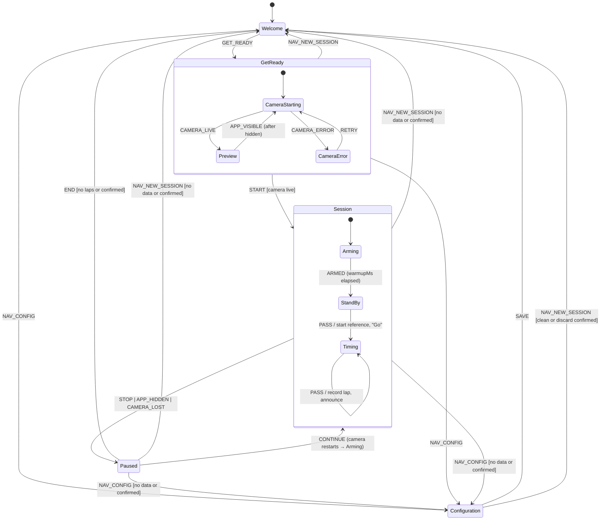

# Drone Lap Counter — v1.0.0 Specification

> Status: **decisions settled, ready for review**, 2026-10-02. No code exists for v1 yet.
> Inputs: PoC in [drone-lap-poc/](../../drone-lap-poc/), [brainstorm](../PoC/brainstorm.md), [dev plan](../PoC/dev-plan.md), [first phone tests](../PoC/first-tests-findings.md).

---

## 0. Decisions

All decisions are settled (2026-10-02). D1–D4 and D6–D10 use the recommended option; D5 was adjusted to also confirm END when laps ≥ 1. The rest of the spec follows these.

| # | Decision | Chosen | Why / alternative |
|---|---|---|---|
| D1 | **Which timestamp a lap uses, and when it is recorded** ✅ decided | Lap time = difference between the backdated `startT` values of accepted passes. The lap is **recorded at `MOTION_END`** (≈100–300 ms after the pass). | If we recorded at `MOTION_START`, a pass that later turns out `REJECTED` (long motion) would need its beep and spoken time taken back. `Δpeak` is the alternative; switch only if the PoC Phase 3 data shows a lower spread. |
| D2 | **Default camera** ✅ decided | Front camera (`facingMode: 'user'`). The phone lies face-up on the floor and films the ceiling. You can pick another camera or the rear one in Configuration. | Matches the brainstorm setup, and the screen stays visible. The rear camera gives better images but needs a stand. |
| D3 | **Live tuning panel on Configuration** ✅ decided (preview + diff + ratio meter + **Calibrate**) | **Yes**, as a collapsible "Test & calibrate" section. | `calibrationMs`/`calibrationK`/thresholds can't be tuned without seeing the camera, and Calibrate is a PoC feature. |
| D4 | **Developer tools** ✅ decided (video-file replay, CSV export, HUD, event log) | Keep them, hidden behind `?debug=1` as a "Diagnostics" section on Configuration. | Phase 3 and tuning on new phones still need them. Leaving them out of v1 would mean keeping the PoC alive. |
| D5 | **When to ask for confirmation** ✅ decided | `New session` / `Configuration` during Session or Paused ask **"End session?"** only when the session has data (laps, or timing running). **END asks for confirmation when laps ≥ 1**; with 0 laps it goes straight to Welcome. | Lap data can't be recovered once discarded, so every action that throws laps away asks first. |
| D6 | **App backgrounded or screen locked mid-session** ✅ decided | **Auto-pause**: the same as STOP, plus a banner and an audible "paused" cue. | The camera stops anyway (iOS ends the track, Android freezes it), so pausing explicitly avoids a fake lap spanning the gap. |
| D7 | **Repo layout and deployment** ✅ decided | New project in `app/` at the repo root. GitHub Pages serves v1 at the root URL and the PoC at `/poc/` (without its service worker) until v1.1. | Keeps the PoC usable as a tuning tool. Alternative: replace the PoC in place. |
| D8 | **Gate: PoC Phase 3 field test** ✅ decided | Run it in parallel with M1–M2. It must be done before M3 freezes the detection defaults. | Real whoop/ceiling accuracy hasn't been measured yet (see [findings](../PoC/first-tests-findings.md)). It is the biggest product risk. |
| D9 | **Spoken phrases** ✅ decided | First pass: "Go". Each lap: "12.34" (2 decimals). New best: "Best, 12.34". Paused: "Paused". English only. | Short enough to finish well before the next lap (≥ 5 s indoors). Lap number off by default. |
| D10 | **UI framework** ✅ decided | React 19 + TS. | Best support for Motion and the test tooling. If the JS budget (≤ 130 KB gz) is at risk, lazy-load the Configuration tuning panel and debug tools instead of switching framework. |

---

## 1. Existing codebase analysis

### 1.1 Structure

| File | LOC | Role | DOM? |
|---|---|---|---|
| `src/main.js` | 326 | Everything else: UI wiring, frame loop, stats HUD (250 ms `setInterval`), event log, calibration flow, exposure/focus sync by polling, generated config inputs, CSV download, ROI presets | yes |
| `src/config.js` | 39 | Mutable singleton `config` + `roiPresets`. Other modules read it **live, by reference** | no |
| `src/source.js` | 150 | `getUserMedia`, video file, rVFC loop (rAF fallback), timestamps (`captureTime` → `now`, files `mediaTime·1000`), dropped/gap/seek detection, `applyExposure`/`applyFocus` | yes |
| `src/motion.js` | 147 | **Pure core** `toLuma`, `diffLuma` + canvas glue `createMotion` (ROI crop, buffer swap, global guard, debug mask, per-stage timing) | glue only |
| `src/detector.js` | 117 | **Pure** state machine `WARMUP → IDLE → CANDIDATE → MOTION` | no |
| `src/calibration.js` | 20 | **Pure** threshold calibration | no |
| `src/storage.js` | 25 | localStorage load/save with type/finite checks, storage can be injected | no |
| `src/recorder.js` | 33 | Typed-array frame recorder + CSV builders (200k rows preallocated) | no |
| `src/graph.js` | 54 | Ratio ring-buffer graph on its own endless rAF loop | yes |
| `src/beep.js` | 22 | Web Audio 880 Hz / 60 ms beep, unlocked on any click | yes |
| `src/pwa.js`, `public/sw.js`, `manifest.webmanifest` | — | Hand-written network-first service worker (prod only), manifest `orientation: any` | — |
| `test/*.test.js` | ≈450 | `node:test`: detector (30 cases incl. fps independence), motion core, calibration, recorder, storage | — |

Deployment: `.github/workflows/deploy.yml` runs `npm ci → test → build` and pushes `drone-lap-poc/dist` to GitHub Pages.

### 1.2 Detection pipeline (per camera frame)

1. **Frame clock**: `requestVideoFrameCallback` gives one callback per camera frame (fallback: rAF + skip frames whose `currentTime` hasn't changed). `t` = `captureTime` ?? `now`. Files use `mediaTime·1000`. If the gap since the last frame is > `resetGapMs` → `gapReset` (no diff).
2. **ROI crop**: `drawImage(video, roi→px)` into a canvas whose longest side is ≤ `processingMaxSize`, then `getImageData`. This is the cost centre: 6–14 ms on Android.
3. **Luma**: `(77r+150g+29b)>>8` into reused `Uint8Array`s (swapped, not copied).
4. **Diff**: a pixel is changed if `|cur − prev − offset| > pixelDiffThreshold`, where `offset` = mean shift when `brightnessNormalize` is on. `ratio = changed / pixels`.
5. **Global guard** (optional): the full frame at 80×60 with the ROI excluded. If `globalRatio > globalGuardRatio`, the frame is marked `global`. Frames with no previous frame are also neutral.
6. **Detector**:
   - WARMUP (`warmupMs`) → IDLE.
   - IDLE → CANDIDATE when `ratio ≥ startRatio`.
   - CANDIDATE → MOTION once the motion has lasted `minMotionMs`; it emits `MOTION_START` **backdated to the first frame**, or `SUPPRESSED` if inside `cooldownMs` of the last accepted start.
   - MOTION ends after `endHoldMs` of `ratio < endRatio` (hysteresis) → `MOTION_END {startT,endT,peakT,peakRatio,frames,dStart,dPeak}`.
   - Motion longer than `maxMotionMs` → `REJECTED` + re-arm after `endHoldMs` of quiet.
   - Global and gap frames are neutral everywhere.
7. **Calibration**: idle ratios over `calibrationMs` → `startRatio = max(mean + k·σ, 1.2·max, 0.002)`, `endRatio = startRatio/2`. Global frames are excluded.

### 1.3 Settings inventory

The PoC only checks types and finite values (`storage.js`). The only bounds anywhere are the ROI inputs' HTML `min/max/step`. The **v1 range** column is a proposal.

| Key | Type / unit | Default | PoC range | v1 range | v1 group / fate |
|---|---|---|---|---|---|
| `cameraWidth` | int px | 240 | any | 120–1920 | Camera › advanced |
| `cameraHeight` | int px | 480 | any | 120–1920 | Camera › advanced |
| `cameraFps` | int fps | 30 | any | 15 / 24 / 30 / 60 (select) | Camera |
| `fpsExact` | bool | false | — | — | Camera › advanced |
| `exposureManual` | bool | true | — | — | Camera (shows "not supported" when the device lacks it) |
| `exposureTime` | ×100 µs | 100 | any; clamped to device caps when applied | 1–1000, clamped to caps | Camera |
| `focusLock` | bool | false | — | — | Camera › advanced |
| `processingMaxSize` | int px | 320 | any | 80–640, step 16 | Performance |
| `pixelDiffThreshold` | luma 0–255 | 10 | any | 1–100 | Detection |
| `brightnessNormalize` | bool | false | — | — | Detection › advanced |
| `globalGuard` | bool | false | — | — | Detection › advanced |
| `globalGuardRatio` | fraction | 0.2 | any | 0.01–1 (shown as %) | Detection › advanced |
| `showDisplay` | bool | true | — | — | **Retired.** The preview only exists on Get Ready / tuning and never runs during Session |
| `readbackHint` | bool | true | — | — | Performance |
| `startRatio` | fraction | 0.02 | any | 0.0005–0.5 (%) | Detection (set by Calibrate) |
| `endRatio` | fraction | 0.01 | any | 0.0001–`startRatio` | Detection |
| `minMotionMs` | ms | 30 | any | 0–500 | Timing filters |
| `endHoldMs` | ms | 60 | any | 0–1000 | Timing filters |
| `cooldownMs` | ms | 1500 | any | 0–30000 (= **minimum lap time**) | Timing filters |
| `maxMotionMs` | ms | 3000 | any | 200–30000, > `minMotionMs` | Timing filters |
| `warmupMs` | ms | 1500 | any | 0–10000 (= **arming time** after START/CONTINUE) | Timing filters |
| `resetGapMs` | ms | 250 | any | 50–2000 | Performance › advanced |
| `calibrationMs` | ms | 3000 | any | 1000–30000 | Test & calibrate |
| `calibrationK` | σ multiplier | 5 | any | 1–20 | Test & calibrate |
| `roi.{x,y,width,height}` | fraction | full frame `0,0,1,1` | 0–1 step 0.01 (UI only) | 0–1; w,h ≥ 0.05; x+w ≤ 1; y+h ≤ 1 | Detection › Region (presets `full`/`box`/`vLine`/`hLine` + custom) |
| *mute* (UI only) | bool | false | not persisted | — | becomes `audio.beep` |
| **new** `camera.facing` | `'user'｜'environment'` | `'user'` | — | — | Camera |
| **new** `camera.deviceId` | string ｜ null | null | — | — | Camera (falls back to `facing` if missing) |
| **new** `audio.beep` / `audio.voice` / `audio.announceBest` | bool | true / true / true | — | — | Audio |

Hard-coded constants that stay as they are: `MIN_START` 0.002, guard size 80×60, luma weights.

### 1.4 Weaknesses and production risks

| Area | Issue |
|---|---|
| Coupling | `main.js` is a god module. `config` is a shared mutable object, so a change mid-pass takes effect on the next frame with no validation. `createMotion` calls `document.createElement`, so it can't run in a worker or a unit test. |
| Settings | No ranges or cross-field rules (e.g. `endRatio > startRatio`, negative ms). Every keystroke is persisted (no Save/Cancel). |
| Performance | `getImageData` allocates ≈ 200 KB per frame (≈ 6 MB/s of garbage, which risks GC hitches). `graph.js` runs rAF forever and the HUD runs a 250 ms interval forever, even when nothing is shown. The recorder preallocates ≈ 5 MB at startup. |
| Lifecycle | No handling of `visibilitychange`, track `ended`/`mute`, wake lock or orientation. The rVFC loop is never cancelled on `stopCamera`. Exposure/focus are applied by polling. |
| Audio | The context is unlocked on *any* click. The iOS `interrupted` state isn't handled. The beep fires on `MOTION_START`, including passes later `REJECTED`. No speech. |
| PWA | Network-first SW has no precache: the first offline launch only works after a full online visit, and it has no update flow. `orientation: any`. Icons only (no apple-touch 180, no screenshots). |
| Product | No lap or session model (only `dStart`/`dPeak` log lines). No error UX beyond a red text span. No camera `facingMode`. |
| Detection quality | Phase 3 (real whoop/ceiling) **not done**. iOS: manual exposure is probably unsupported, and the default threshold 10 was tuned for a darker, locked-exposure image. The pilot's hand or body near the phone at START/STOP can trigger passes. |

### 1.5 Reuse vs refactor

| Keep as-is (port to TS 1:1, port tests) | Refactor | Replace |
|---|---|---|
| `detector.js` (+ all 30 tests) | `motion.js` glue → `FrameAnalyzer` with an injected canvas factory (DOM or `OffscreenCanvas`); adds a reset when frame size changes | `main.js` → React UI + app state machine + effects |
| `toLuma` / `diffLuma` (+ tests) | `source.js` → `CameraSource`/`FileSource` classes: `stop()` cancels rVFC, emits `ended`, adds `facingMode` + deviceId fallback chain | `sw.js`/`pwa.js` → `vite-plugin-pwa` |
| `calibration.js` (+ tests) | `storage.js` → schema-driven validation + v1 → v2 migration | `graph.js` → debug-only component that draws only while mounted |
| `recorder.js` (debug only) | `beep.js` → `audio/` (cues + speech + unlock) | `index.html`/`style.css` |

---

## 2. Tech stack

| Concern | Choice | Rationale | Trade-off |
|---|---|---|---|
| Language | TypeScript (strict) | Typed settings/events and safe refactors of the ported engine | Build step (Vite handles it) |
| UI | React 19 (D10) | Mature, best Motion/testing support, familiar | ≈ 60 KB gz runtime |
| Build | Vite (current major, 8.x as in the PoC) + `@vitejs/plugin-react` | Already in use, fast, PWA plugin | — |
| Styling | Tailwind CSS v4 (`@tailwindcss/vite`), tokens in `@theme` | No runtime, design tokens as CSS variables, quick responsive variants | Class-heavy markup |
| Motion | `motion` (`motion/react`) with `LazyMotion` + `m` + `domAnimation` | `AnimatePresence` exit transitions and list layout animations are painful in plain CSS; `MotionConfig reducedMotion="user"` | ≈ 15–20 KB gz; animate only transform/opacity |
| App state | Pure reducer `(state, event) → {state, effects}` + **Zustand** (≈ 1 KB) store | The reducer can be unit-tested; the engine can dispatch from outside React without per-frame re-renders | XState gives visual tooling at ≈ 4× the size and a learning curve; not needed for 5 screens |
| Routing | **None.** The screen is a state-machine value; `?debug=1` is read once | No deep links into a session that can't be restored | No back-button navigation (see §3.4) |
| Settings schema | Hand-written metadata table (key, type, default, min/max/step, unit, group, help) that drives validation **and** form generation | The PoC already generates inputs from config. No Zod/Valibot needed | Write our own ≈ 60-line validator |
| Beeps | **Web Audio API directly** (oscillator + gain envelope) | No audio assets, < 20 ms latency, ≈ 40 LOC. **Howler.js rejected**: its value is file playback, sprites and an HTML5 fallback, none of which we need | — |
| Spoken times | `speechSynthesis` | 0 bytes, on-device voices on iOS/Android, offline | Voice and latency vary by device (§2.3); recorded-digit fallback deferred |
| PWA | `vite-plugin-pwa` (`generateSW`, Workbox precache, `registerType: 'prompt'`) + `@vite-pwa/assets-generator` for icons | Precache, update prompt, manifest generation | Workbox runtime ≈ 5 KB in the SW |
| Fonts | `@fontsource-variable/inter`, `@fontsource-variable/jetbrains-mono` (latin subset, self-hosted) | Work offline, no third-party requests | ≈ 80 KB woff2, precached |
| Icons | `lucide-react` (tree-shaken) | ≈ 1 KB per icon | — |
| Unit tests | Vitest (+ `@testing-library/react` for a few components, happy-dom) | Vite-native. The `node:test` + `assert` tests port almost verbatim | — |
| E2E | Playwright: Chromium with a **fake camera fed from a `.y4m` clip**; WebKit for layout smoke | Lets the real detection pipeline run end-to-end in CI | No real-camera quirks; manual device matrix still needed |
| Lint/format | Biome (lint + format, `noRestrictedImports` for module boundaries) | One dependency instead of ESLint + Prettier + plugins | Fewer React-specific rules than `eslint-plugin-react-hooks` (Biome has `useExhaustiveDependencies`) |
| Hosting | GitHub Pages via the existing Actions workflow | HTTPS, free, already wired | No custom headers or PR previews. Cloudflare Pages if previews are wanted |

**Budgets**: initial JS ≤ 130 KB gz (estimate ≈ 105: React 60, Motion 18, app 25, misc 2), fonts ≤ 100 KB, Lighthouse PWA "installable", detection ≥ 27 processed fps on the reference Samsung at 240×480@30 (parity with the PoC), engine ≤ 15 ms/frame p95.

### 2.1 Camera (`getUserMedia`)

- **Secure context**: Pages is HTTPS. For dev on a phone: `vite --host` + `@vitejs/plugin-basic-ssl` (or mkcert). If `isSecureContext` is false → show the "Open over HTTPS" error.
- **Constraints**: `{ audio: false, video: { deviceId?: {exact}, facingMode: {ideal: facing}, width: {ideal}, height: {ideal}, frameRate: fpsExact ? {exact} : {ideal} } }`.
- **Device selection**: saved `deviceId` (exact) → on `OverconstrainedError`/`NotFoundError` retry with `facingMode` → then any camera. Device labels are only available after permission, so re-enumerate after the first grant and on `devicechange`.
- **After start**: apply exposure/focus with `applyConstraints({advanced})` (mostly Android Chrome). Show what was actually applied (`getSettings()`) and the capability (`supported / not supported`) in Configuration.
- **Permission UX**: GET READY (a user tap) calls `getUserMedia` directly. While the browser prompt is up, show an explainer: "Camera is used only on this device to see the drone pass; nothing is recorded or uploaded". Errors are mapped in §3.4.
- **iOS**: one `<video playsinline muted autoplay>` element stays mounted for the whole app life. The installed PWA may re-ask for camera permission on each launch (known WebKit behaviour), so test early.
- **Preview**: show the `<video>` element itself (GPU-composited, cheaper than the PoC's per-frame `drawImage`), with an absolutely positioned ROI overlay. Mirror the front camera (`scaleX(-1)` on the container, overlay included).

### 2.2 Screen Wake Lock

- `navigator.wakeLock.request('screen')` on entering Get Ready, held through Session and Paused, released on Welcome/Configuration. Re-acquire on `visibilitychange → visible` (the lock is dropped automatically when the page is hidden).
- Support: Chromium 84+, Safari 16.4+ (installed iOS PWA fixed in 18.4).
- **Fallback**: no NoSleep-style hidden video hack, which is unreliable and adds a dependency. If the request is unsupported or rejected → a dismissible banner: "Screen may turn off. Set Auto-Lock to Never during sessions."

### 2.3 Audio strategy (beep + spoken time)

| Topic | Strategy |
|---|---|
| Unlock | Create or `resume()` the `AudioContext` **and** prime `speechSynthesis` (speak `' '` at volume 0) inside the GET READY, START and CONTINUE tap handlers. iOS requires the first `speak()` to come from a gesture. |
| iOS states | If the context reports `interrupted`/`suspended` (calls, backgrounding) → resume on the next gesture (CONTINUE). If it is still not running after START → banner "Tap to enable sound". |
| iOS silent switch | Web Audio is muted by the ring/silent switch. Set `navigator.audioSession.type = 'playback'` where available (Safari 17+, verify). Whether speech obeys the switch: verify in M4. |
| Voice choice | Prefer an `en-*` voice with `localService: true` (desktop Chrome's "Google" voices need the network). Load with `getVoices()` + `voiceschanged`. No voice → beep only, and Configuration shows "Voice not available". |
| Latency | Beep < 20 ms. Speech typically 100–400 ms after priming; the first utterance without priming can take ~1 s. Call `speechSynthesis.cancel()` before each new utterance so a lap never queues behind an old one. Rate 1.1. |
| Cues | `armed`: soft 440 Hz 120 ms · `go` (first pass): 660→990 Hz + "Go" · `lap`: 880 Hz 60 ms (PoC) + "12.34" · `best`: lap beep + "Best, 12.34" · `paused` (auto): 990→495 Hz + "Paused". |

### 2.4 Main thread vs Worker

| Option | Pros | Cons | v1 |
|---|---|---|---|
| A. Main thread, rVFC + 2D canvas readback (PoC) | Measured 27–30 fps on Android, works on iOS | Readback blocks the main thread for 6–14 ms | **Default.** The Session UI is static between laps, and React never renders per frame |
| B. Worker + `OffscreenCanvas`, frames sent as `createImageBitmap(video)` (transferable) | Readback and diff leave the main thread | Extra bitmap copy, async latency; needs measuring | Spike in v1.1 if M9 shows UI jank |
| C. Worker + `MediaStreamTrackProcessor` → `VideoFrame.copyTo()` (Y plane = luma for free) | Fastest, no RGBA conversion | Chromium-first; Safari support partial (verify) | v1.x behind the same interface |

The engine is built behind `FrameSource → FrameAnalyzer → Detector` so B or C later only replaces the analyzer host. The pure core stays free of DOM calls so it can run in a worker.

### 2.5 PWA shell

- **Manifest** (generated): `name` "Drone Lap Counter", `short_name` "Lap Counter", `id`/`start_url`/`scope` `./`, `display: standalone`, **`orientation: portrait`**, `background_color`/`theme_color` `#0A0D12`, icons 192/512/maskable-512, apple-touch-icon 180, 2 screenshots (richer Android install sheet).
- **Offline**: precache all build assets and fonts; `navigateFallback: index.html`. The app works fully offline after the first load. At activation, delete the PoC's `lap-counter-v1` cache (the same scope URL means the v1 SW replaces the PoC SW).
- **Updates**: `registerType: 'prompt'`. The "New version — Reload" toast is shown **only on Welcome/Configuration**, never mid-session.
- **Install**: catch `beforeinstallprompt` → "Install app" link in the Welcome footer. On iOS, a one-time hint card ("Share → Add to Home Screen") whose dismissal is kept in `dronelap.ui.v1`. Hidden when `display-mode: standalone`.
- **Orientation**: the manifest lock covers installed Android. `screen.orientation.lock()` is only tried when it's allowed. iOS ignores both, so rotation must be handled anyway (§3.4).
- **Safe areas and viewport**: `viewport-fit=cover`; top bar `padding-top: env(safe-area-inset-top)`; bottom action bar `padding-bottom: max(16px, env(safe-area-inset-bottom))`; `100dvh`; `overscroll-behavior: none` (no pull-to-refresh mid-session); `touch-action: manipulation`; `apple-mobile-web-app-status-bar-style: black-translucent`.

### 2.6 Persistence (localStorage only)

| Key | Content | Written |
|---|---|---|
| `dronelap.settings.v2` | `Settings` JSON (`version: 2`) | Only on **Save** |
| `dronelap.ui.v1` | `{ installHintDismissed }` | On change |
| `dronelap.settings.v1` (PoC) | read once for migration, then left alone | never |

- **Load**: parse → migrate the v1 flat keys into v2 groups (legacy keys like `minMotionFrames` are dropped) → validate each field against the schema (wrong type or out of range → default for that field) → apply cross-field rules (`endRatio ≤ startRatio`, ROI inside the frame).
- Storage unavailable or quota exceeded → keep settings in memory and show the toast "Settings can't be saved on this device".
- Note: every `*.github.io` project of one user shares one origin and one localStorage, so the `dronelap.` prefix is mandatory.
- **No session data is ever stored.** It lives in memory only.

### 2.7 Hosting and deployment

GitHub Pages via an extended `deploy.yml`: build `app/` → `dist/`, build the PoC into `dist/poc/` with SW registration removed (D7). Keep `base: './'` so the app works at any sub-path. HTTPS comes from Pages.

---

## 3. UX and screens

### 3.1 Screens

| Screen | Content (top → bottom) | Top menu |
|---|---|---|
| **Welcome** | Top menu · big centered **GET READY!** · footer: install link / iOS hint / update toast | `New session` · `Configuration` |
| **Get Ready** | Top menu · live camera preview with ROI overlay (the border flashes on a detected pass so you can test with a hand wave) · camera health line (`30 fps`, warnings) · big red **START** | same |
| **Session** | Top menu · status strip (`ARMING` → `STAND-BY` → `TIMING`, fps warning) · **(b)** large latest lap time + label (`LAP 5`, `BEST` badge if best) · summary `Laps 5 · Best 11.98` · **(c)** history list, newest first, best in fluorescent green · **(d)** big red **STOP** | same (with confirmation, D5) |
| **Session – paused** | Same as Session, status `PAUSED` (+ reason banner when auto-paused), camera and detection stopped; **CONTINUE** (primary) + **END** (secondary, confirms when laps ≥ 1) instead of STOP | same (with confirmation) |
| **Configuration** | Grouped settings (Camera, Detection, Timing filters, Audio, Performance; *Advanced* collapsed in each) · ROI presets · "Test & calibrate" (D3) · Reset to defaults · Diagnostics (`?debug=1`, D4) | `New session` · **`Save`** |

### 3.2 State machine



Dialogs (`leaveSession`, `endSession`, `discardConfig`) are a `dialog` field over the current state, not separate screens. `CANCEL` closes them and nothing else changes. Detection keeps running while a dialog is open, and passes are still recorded.

**Transition table.** Each row is one reducer unit test. "Stop all" = `engine.stop`, `camera.stop`, `wakeLock.release`.

| State | Event | Guard | Next | Effects |
|---|---|---|---|---|
| Welcome | `GET_READY` | — | GetReady/CameraStarting | `audio.unlock`, `camera.start`, `wakeLock.acquire` |
| Welcome | `NAV_CONFIG` | — | Configuration (clean) | — |
| Welcome | `NAV_NEW_SESSION` | — | Welcome | none (no-op) |
| GetReady | `CAMERA_LIVE` | — | Preview | `engine.start` (meter/flash only; passes ignored by lap logic) |
| GetReady | `CAMERA_ERROR` | — | CameraError(kind) | — |
| GetReady | `RETRY` | — | CameraStarting | `camera.start` |
| GetReady | `START` | camera live | Session/Arming, empty session, timing `standby` | `audio.unlock`, `engine.reset` (warm-up) |
| GetReady | `APP_HIDDEN` / `APP_VISIBLE` | — | stays; camera stopped / restarted | `engine.stop`+`camera.stop` / `camera.start` |
| GetReady | `NAV_NEW_SESSION` / `NAV_CONFIG` | — | Welcome / Configuration | stop all |
| Session | `ARMED` | — | StandBy | `audio.cue armed` |
| Session | `PASS` | timing `standby` | Timing, `refT = pass.startT` | `audio.cue go` |
| Session | `PASS` | timing `running` | Timing, lap appended, `refT = pass.startT` | `audio.cue lap｜best` |
| Session | `STOP` | — | Paused(user), timing → `standby` (in-progress lap discarded) | `engine.stop`, `camera.stop` (wake lock kept) |
| Session | `APP_HIDDEN` | — | Paused(hidden) | as STOP + `audio.cue paused` |
| Session | `CAMERA_LOST` | — | Paused(cameraLost, error) | as STOP + `audio.cue paused` |
| Session/Paused | `NAV_NEW_SESSION` / `NAV_CONFIG` | has data | dialog `leaveSession(to)` | — |
| Session/Paused | `NAV_NEW_SESSION` / `NAV_CONFIG` | no data | Welcome / Configuration, session = null | stop all |
| Session/Paused | `CONFIRM` (leaveSession) | — | `to`, session = null | stop all |
| Session/Paused | `CANCEL` (any dialog) | — | unchanged, dialog = null | — |
| Paused | `CONTINUE` | — | Session/Arming (laps kept, timing `standby`) | `audio.unlock`, `camera.start` → on `CAMERA_LIVE`: `engine.start` |
| Paused | `CAMERA_ERROR` (after CONTINUE) | — | Paused + error banner | — |
| Paused | `END` | laps ≥ 1 | dialog `endSession` | — |
| Paused | `END` | laps = 0 | Welcome, session = null | `wakeLock.release` |
| Paused | `CONFIRM` (endSession) | — | Welcome, session = null | `wakeLock.release` |
| Configuration | `CONFIG_CHANGED` | — | dirty = draft ≠ saved | — |
| Configuration | `SAVE` | draft valid | Welcome | `settings.commit` |
| Configuration | `NAV_NEW_SESSION` | clean / dirty | Welcome / dialog `discardConfig` | — |
| Configuration | `CONFIRM` (discardConfig) | — | Welcome | `settings.revert` |
| any | event not listed for the state | — | unchanged | none (logged in debug) |

"Has data" = `laps.length > 0 || timing.kind === 'running'`.

### 3.3 Lap semantics

```
PASS(t):   standby → running(refT = t)              // first pass: no lap, says "Go"
           running → lap = t − refT; refT = t       // every later pass records a lap
STOP:      running|standby → standby                // in-progress lap dropped, laps kept
CONTINUE:  standby, detector reset (warm-up)        // next PASS re-starts the reference
```

- `t` = the backdated `startT` of an accepted pass, reported at `MOTION_END` (D1). `SUPPRESSED` and `REJECTED` passes never reach the lap logic.
- All times come from frame timestamps (`performance.now()` clock), never `Date`, so system clock changes don't matter.
- **A lap never spans a pause.** Time spent paused is never counted. Lap N+1 after CONTINUE needs two passes: the first one only sets the reference.
- **Latest vs history**: the big display = `laps[last]`; the list = `laps[0..last−1]`, newest first. When a lap is recorded, the previous latest lap moves to the top of the list (animated).
- **Best** = min `ms` over all laps (ties → the earlier lap). If the latest lap is best, the big number turns green with a `BEST` badge. Otherwise the best row in the list is green with a ★ badge. Colour is never the only cue.
- **Display format**: `ss.cc` below 60 s, `m:ss.cc` above (rounded to 10 ms; the timing resolution is ≈ 33 ms at 30 fps, so 3 decimals would be false precision).
- **Big display before the first lap**: `--.--` with "Waiting for first pass" (stand-by), then "Lap 1 running" after the first pass. There is no ticking clock.
- **Spoken format**: "12.34"; ≥ 60 s "1 minute 5.34".

### 3.4 Edge cases

| Case | Behaviour |
|---|---|
| Permission denied (`NotAllowedError`) | Get Ready error card: "Camera blocked", platform steps (Android Chrome: ⓘ → Permissions → Camera; iOS: Settings → Safari/App → Camera; desktop: site settings + OS privacy), **Retry**. Use `navigator.permissions.query({name:'camera'})` where available to say "blocked" vs "not yet asked". |
| No camera (`NotFoundError`) | "No camera found". Retry. START hidden. |
| Camera busy (`NotReadableError`) | "Camera in use by another app". Retry. |
| `fpsExact` unsatisfiable (`OverconstrainedError`) | Retry automatically with `ideal`, toast "Exact fps not supported — using best available". |
| Saved `deviceId` gone | Fall back to `facing`, then any camera. Update the selector. |
| Insecure context | "Open this app over HTTPS". |
| Permission revoked / track `ended` mid-session | `CAMERA_LOST` → Paused + banner + audible cue. CONTINUE retries the camera. |
| Tab backgrounded / screen locked mid-session | `APP_HIDDEN` → auto-pause (D6), in-progress lap discarded. On return: Paused with banner "Paused — app was in background". Wake lock re-acquired. |
| Backgrounded on Get Ready | Camera stopped. Restarted automatically on return. |
| Device rotation / flat-phone orientation flip | Layout reflows. The analyzer sees the frame size change → buffers reset → the next frame is neutral → no false pass. The ROI stays relative, which is a physically different area for non-full presets, so the portrait lock (manifest) reduces this. Covered by a test. |
| Unsaved config + `New session` | Dialog "Discard changes?": **Discard** / **Keep editing**. Save stays in the menu. |
| `New session` / `Configuration` during session | Confirm only when there is data (D5): "End session? 12 laps will be discarded." |
| END with laps ≥ 1 | Same dialog (D5): "End session? 12 laps will be discarded." **End session** (danger) / **Cancel** (default focus, so an accidental Enter doesn't discard). With 0 laps, END goes straight to Welcome. |
| Browser reload/close with laps | Data is lost by design (no persistence). A `beforeunload` prompt is set while laps exist (works on desktop, best effort on mobile). |
| Rapid / double taps | Primary buttons ignore taps for 300 ms after a transition. The reducer ignores events that aren't valid for the state. |
| Pass at the moment of STOP | `engine.stop()` is synchronous and bumps a run id. Events from an older run are dropped. |
| STOP during Arming | Paused, no data change. |
| Very long lap list | Kept in memory (≈ 50 B/lap). The list renders the newest 500 rows plus "+N older laps", with `content-visibility: auto` on rows. Best is computed incrementally (O(1) per lap). |
| Lap shorter than `cooldownMs` | Suppressed by the detector. Configuration explains: "cooldown = minimum lap time". |
| Pilot's hand near the camera at START | Covered by `warmupMs` (arming). The `armed` cue tells the pilot when detection is live. |
| Pilot approaching the phone to press STOP | May record one false last lap. **Known v1 limitation.** Mitigated in part by `maxMotionMs` (long body motion is rejected); "undo last lap" is deferred (§6.3). |
| Low frame rate (< 20 fps for 2 s) | Amber status chip "Low frame rate — passes may be missed". The Configuration hint links to the Performance group. |
| Audio still locked after START | Banner "Tap to enable sound". The next tap resumes the context. |
| No speech voice | Beep only. Configuration shows the voice as unavailable. |
| Wake lock unavailable or rejected | Banner hint (§2.2). The session continues. |
| Storage unavailable | In-memory settings + toast on Save. |
| SW update available mid-session | Deferred. The toast appears on the next Welcome. |
| Desktop / keyboard | `Space`/`Enter` = the visible primary action (GET READY / START / STOP / CONTINUE). `Esc` closes dialogs. Full Tab order. |
| Browser back button / Android back gesture | No history entries are pushed, so back leaves the app (installed) or the page. While a session has data, a `beforeunload` prompt is set. Pushing a guard entry instead is deferred. |

---

## 4. Visual design

Dark mode only, neon accents. This overrides the repo skill `html-css-style-color-guide` (light backgrounds, no neon) because of the explicit requirement. Its useful rules are kept: red only for critical actions, near-white rather than pure white text, no pink/magenta.

### 4.1 Color tokens

| Token | Hex | Use | Contrast |
|---|---|---|---|
| `--bg` | `#0A0D12` | App background | — |
| `--surface` | `#121821` | Top bar, cards, dialogs | — |
| `--surface-2` | `#1A2230` | Inputs, alternate rows | — |
| `--border` | `#273244` | Dividers, outlines | — |
| `--text` | `#F0F2F3` | Primary text, lap digits | 17:1 on bg |
| `--text-muted` | `#9AA6B6` | Labels, secondary | 7.9:1 on bg |
| `--accent` | `#22E5FF` (neon cyan) | GET READY, CONTINUE, active menu item, focus ring | 12.7:1 on bg |
| `--accent-ink` | `#001B22` | Text on accent | 11.6:1 on accent |
| `--danger` | `#E11D2E` | START / STOP fill, END outline | white text 4.7:1; 4.1:1 vs bg |
| `--danger-glow` | `#FF4D5E` | Glow / pressed ring | — |
| `--best` | `#39FF14` (fluorescent green) | Best lap digits / badge | 14.3:1 on bg |
| `--best-ink` | `#031A00` | Text on a green badge | high |
| `--warn` | `#FFB020` | ARMING / STAND-BY chip, warnings | 10.6:1 on bg |

Glow (`box-shadow 0 0 24px <color>/40%`) is decoration only. It disappears in bright light, so no information depends on it.

### 4.2 Typography, spacing, sizes

| Item | Spec |
|---|---|
| UI font | Inter Variable, `font-variant-numeric: tabular-nums` |
| Lap digits | JetBrains Mono Variable 800 (tabular by design; clear 0/8 and 1/7) |
| Latest lap | `clamp(4.5rem, 24vw, 12rem)`, line-height 1 |
| History rows | 1.75rem mono 600, row height 56 px |
| Button labels | 1.75–2.25rem Inter 800, uppercase, letter-spacing 0.04em |
| Body / settings | 1rem (16 px, no iOS zoom on inputs) |
| Spacing scale | 4 · 8 · 12 · 16 · 24 · 32 · 48 · 64 px |
| Radii | 12 px cards, full pill for bar buttons, circle for hero buttons |
| Hero buttons (GET READY, START) | Circle `min(72vw, 320px)`, ≥ 200 px |
| Action bar (STOP / CONTINUE + END) | Bottom-anchored, 112 px tall (≥ 96), full width minus 16 px gutters, inside the thumb zone. CONTINUE : END = 2 : 1, 16 px gap |
| Top menu items | ≥ 48 px tall, 18 px semibold, icon + label |
| Touch targets | ≥ 48×48 px everywhere |

**Readability at distance and in bright light**: the latest lap is the largest element and readable from ≈ 3 m. Essential info uses weight ≥ 600 and only `--text`, `--best` or `--warn` (never `--text-muted`). State is shown with text plus colour. The page can't control screen brightness, so the user guide recommends max brightness.

### 4.3 Wireframes (portrait phone)

```
WELCOME                         GET READY                        SESSION (timing)
┌───────────────────────────┐   ┌───────────────────────────┐    ┌───────────────────────────┐
│ ▸New session  ⚙Configurat.│   │ ▸New session  ⚙Configurat.│    │ ▸New session  ⚙Configurat.│
├───────────────────────────┤   ├───────────────────────────┤    ├───────────────────────────┤
│                           │   │ ┌───────────────────────┐ │    │ ● TIMING · Lap 6 running  │
│                           │   │ │                       │ │    │                           │
│        ╭─────────╮        │   │ │    live camera        │ │    │  LAP 5                    │
│       ╱           ╲       │   │ │   ┌ ─ ─ ROI ─ ─ ┐     │ │    │  12.34                    │
│      │  GET READY! │      │   │ │   └ ─ ─ ─ ─ ─ ─ ┘     │ │    │  Laps 5 · Best 11.98      │
│       ╲           ╱       │   │ └───────────────────────┘ │    │ ───────────────────────── │
│        ╰─────────╯        │   │  ✓ 30 fps · front camera  │    │  #4   12.87               │
│     (neon cyan, glow)     │   │        ╭─────────╮        │    │  #3   11.98  ★ BEST       │
│                           │   │       │  START  │ (red)   │    │  #2   13.40               │
│                           │   │        ╰─────────╯        │    │  #1   14.02               │
│ Install app · v1.0.0      │   │                           │    │ ┌───────────────────────┐ │
└───────────────────────────┘   └───────────────────────────┘    │ │         STOP          │ │
                                                                 │ └───────────────────────┘ │
                                                                 └───────────────────────────┘
PAUSED                          CONFIGURATION
┌───────────────────────────┐   ┌───────────────────────────┐
│ ▸New session  ⚙Configurat.│   │ ▸New session      ✓ Save  │  (Save highlighted when dirty)
├───────────────────────────┤   ├───────────────────────────┤
│ ⏸ PAUSED                  │   │ ▾ Camera     front · 30fps│
│ ⚠ App was in background   │   │ ▾ Detection               │
│  LAP 5                    │   │   Pixel threshold [−] 10 [+]
│  12.34                    │   │   Start ratio  ───●── 2.0%│
│  Laps 5 · Best 11.98      │   │   Region  [Full|Box|V|H|…]│
│ ───────────────────────── │   │ ▸ Timing filters          │
│  #4   12.87               │   │ ▸ Audio                   │
│  #3   11.98  ★ BEST       │   │ ▸ Performance             │
│ ┌───────────────┐ ┌─────┐ │   │ ▸ Test & calibrate        │
│ │   CONTINUE    │ │ END │ │   │ ▸ Diagnostics (debug)     │
│ └───────────────┘ └─────┘ │   │ [ Reset to defaults ]     │
└───────────────────────────┘   └───────────────────────────┘
```

**Settings controls**: number fields with −/+ steppers and units, sliders for ratios (shown in %), segmented controls for presets and selects. Each field shows a one-line help text, a "changed" dot when it differs from the default, and an inline error when out of range (Save disabled while invalid).

**Landscape / desktop**:

```
SESSION, landscape phone / ≥ 768 px              DESKTOP ≥ 1024 px: centered, max-width 1040
┌──────────────────────────────────────────────┐
│ ▸New session  ⚙Configuration     ● TIMING     │  Welcome/Get Ready: single column, max-width 480,
├────────────────────────────┬─────────────────┤  preview ≤ 640 px wide, START beside the preview
│  LAP 5                     │ #4  12.87       │  in landscape.
│  12.34                     │ #3  11.98 ★     │  Session/Paused: as left; action buttons max 480 px,
│  Laps 5 · Best 11.98       │ #2  13.40       │  right-aligned; keyboard hints shown ("Space").
│ ┌────────────────────────┐ │ #1  14.02       │
│ │          STOP          │ │                 │
│ └────────────────────────┘ │                 │
└────────────────────────────┴─────────────────┘
```

### 4.4 Motion

| Element | Behaviour | Duration / easing |
|---|---|---|
| Screen transition | Fade + 8 px slide in the direction of travel (`AnimatePresence`) | 220 ms, `cubic-bezier(.2,.8,.2,1)` |
| Button press | Scale 0.96 + stronger glow. `navigator.vibrate(20)` where supported (Android) | 80 ms in / 160 ms out |
| New lap | The latest lap number slides up 12 px and fades in; the previous one moves into the list (layout animation) | 180 ms |
| New best | One green glow pulse on the best element, then it stays green | 600 ms, once |
| Status chip change | Cross-fade | 120 ms |
| Dialogs | Fade + scale from 0.98 | 160 ms |

Rules: animate only `transform`/`opacity`; never animate during per-frame work; no idle or looping animations in Session (save CPU and battery).
**`prefers-reduced-motion: reduce`**: `MotionConfig reducedMotion="user"`. Transitions become opacity-only ≤ 100 ms, there are no layout or slide animations, the best-lap pulse becomes a plain colour change, and press feedback uses colour only.

### 4.5 Accessibility basics

- Contrast: AA everywhere (4.5:1 text, 3:1 large text/UI). Lap digits and status reach ≥ 7:1 (see token table).
- Focus: `:focus-visible` gives a 3 px `--accent` ring with 2 px offset. It is never removed. The dialog traps focus (native `<dialog>`) and restores it on close.
- Live updates: the latest-lap block is `aria-live="polite"` with text like "Lap 5, 12.34 seconds, best lap". The status chip is `role="status"`. Auto-pause banners use `role="alert"`.
- Semantics: real `<button>`s, `<nav>` for the top menu, `aria-current` on the active item, labelled form controls with `aria-describedby` for help and error text.
- Best lap: badge text (`BEST`/★) as well as colour.
- No information is only spoken: everything spoken is also on screen.

---

## 5. Architecture

### 5.1 Folder structure

```
app/
├── index.html
├── vite.config.ts            # react, tailwind, pwa, basic-ssl (dev)
├── biome.json · tsconfig.json · playwright.config.ts
├── public/                   # icon sources, robots
├── src/
│   ├── main.tsx              # mount, SW register, store ↔ effects wiring
│   ├── app/
│   │   ├── machine.ts        # pure reduce(state, event) → {state, effects}   (+ .test.ts)
│   │   ├── store.ts          # Zustand: state + dispatch; runs effects
│   │   └── effects.ts        # effect runner: camera, engine, audio, wake lock, settings
│   ├── engine/               # NO React. DOM only in engine/browser/*
│   │   ├── types.ts
│   │   ├── detector.ts       # ported 1:1                                    (+ test)
│   │   ├── motion-core.ts    # toLuma, diffLuma                               (+ test)
│   │   ├── calibration.ts                                                    (+ test)
│   │   ├── engine.ts         # DetectorEngine: source → analyzer → detector → events
│   │   ├── replay.ts         # run detector over recorded {t,ratio,…} rows    (+ golden tests)
│   │   └── browser/
│   │       ├── camera-source.ts  file-source.ts  frame-analyzer.ts
│   ├── session/
│   │   ├── laps.ts           # applyPass, stop, best, formatLap, speechText   (+ test)
│   │   └── types.ts
│   ├── settings/
│   │   ├── schema.ts         # metadata table = defaults, ranges, groups, help
│   │   ├── validate.ts  migrate.ts  storage.ts                               (+ tests)
│   ├── audio/
│   │   ├── cues.ts  speech.ts  unlock.ts  announcer.ts                       (+ announcer test)
│   ├── platform/
│   │   ├── wake-lock.ts  visibility.ts  orientation.ts  install.ts  permissions.ts
│   ├── ui/
│   │   ├── screens/  Welcome.tsx GetReady.tsx Session.tsx Configuration.tsx
│   │   ├── components/ TopBar BigButton ActionBar LapHero LapList StatusChip
│   │   │               ConfirmDialog Banner CameraLayer RoiOverlay SettingField
│   │   └── debug/    RatioGraph DiffView Hud EventLog (lazy-loaded, ?debug=1)
│   └── styles/index.css     # tailwind + @theme tokens
└── e2e/
    ├── fixtures/laps.y4m     # generated synthetic clip (script in e2e/tools)
    └── *.spec.ts
```

**Boundaries** (enforced with Biome `noRestrictedImports`):
- `engine/`, `session/`, `settings/` (except `storage.ts`) and `app/machine.ts` must not import React or `ui/`.
- `engine/*` outside `browser/` must not touch DOM globals.
- `ui/` must not import `engine/browser` directly. It goes through the store/effects. The only exception is `CameraLayer`, which receives the `<video>` element.

### 5.2 Key types

```ts
// engine/types.ts
export type Ms = number;                                   // frame clock: performance.now() or mediaTime*1000
export type Unsubscribe = () => void;
export interface Roi { x: number; y: number; width: number; height: number }   // relative 0–1

export interface DetectionSettings {
  pixelDiffThreshold: number; brightnessNormalize: boolean;
  globalGuard: boolean; globalGuardRatio: number;
  processingMaxSize: number; readbackHint: boolean;
  startRatio: number; endRatio: number;
  minMotionMs: Ms; endHoldMs: Ms; cooldownMs: Ms; maxMotionMs: Ms; warmupMs: Ms; resetGapMs: Ms;
  roi: Roi;
}
export interface CameraSettings {
  facing: 'user' | 'environment'; deviceId: string | null;
  width: number; height: number; fps: number; fpsExact: boolean;
  exposureManual: boolean; exposureTime: number; focusLock: boolean;
}
export interface AudioSettings { beep: boolean; voice: boolean; announceBest: boolean }
export interface CalibrationSettings { durationMs: Ms; k: number }
export interface Settings {
  version: 2; camera: CameraSettings; detection: DetectionSettings;
  calibration: CalibrationSettings; audio: AudioSettings;
}

export interface FrameMeta {
  t: Ms; dropped: number; presented: number | null; gapReset: boolean; seeked: boolean;
  tSource: 'captureTime' | 'now' | 'mediaTime';
}
export interface MotionSample { t: Ms; ratio: number; globalRatio: number; global: boolean; gapReset: boolean }

export type DetectorEvent =
  | { type: 'MOTION_START'; t: Ms; dStart: Ms | null }
  | { type: 'MOTION_END'; t: Ms; startT: Ms; endT: Ms; durationMs: Ms; peakT: Ms; peakRatio: number;
      frames: number; dStart: Ms | null; dPeak: Ms | null }
  | { type: 'SUPPRESSED'; t: Ms; reason: 'cooldown' }
  | { type: 'REJECTED'; t: Ms; reason: 'LONG_MOTION'; startT: Ms; durationMs: Ms };

/** An accepted, finished pass (from MOTION_END). The only thing the lap logic consumes. */
export interface PassEvent { startT: Ms; endT: Ms; peakT: Ms; peakRatio: number }

export type EnginePhase = 'stopped' | 'warmup' | 'armed' | 'motion';
export interface EngineStats {
  fps: number; deliveredFps: number | null; dropped: number; msPerFrame: number;
  ratio: number; tSource: FrameMeta['tSource'];
}
export interface CameraError {
  kind: 'permission' | 'notFound' | 'busy' | 'overconstrained' | 'insecure' | 'ended' | 'unknown';
  message: string;
}

export interface FrameSource {
  readonly video: HTMLVideoElement;
  start(): Promise<{ width: number; height: number; fps: number | null; facing?: string }>;
  stop(): void;                                            // stops tracks and cancels rVFC
  onFrame(cb: (f: FrameMeta) => void): Unsubscribe;
  onEnded(cb: (e: CameraError) => void): Unsubscribe;
}

export interface FrameAnalyzer {                           // browser/frame-analyzer.ts; worker-swappable later
  process(img: CanvasImageSource, w: number, h: number, s: DetectionSettings):
    { ratio: number; globalRatio: number; global: boolean };   // global=true when no previous frame / size changed
  reset(): void;
}

export interface DetectorEngine {
  start(source: FrameSource, s: DetectionSettings): void;  // source already started; enters warm-up
  stop(): void;                                            // synchronous; no events after it returns
  reset(): void;                                           // back to warm-up (START, CONTINUE)
  update(s: DetectionSettings): void;                      // live tuning only (Configuration)
  on(e: 'pass', cb: (p: PassEvent) => void): Unsubscribe;
  on(e: 'phase', cb: (p: EnginePhase) => void): Unsubscribe;
  on(e: 'event', cb: (ev: DetectorEvent) => void): Unsubscribe;   // debug log
  on(e: 'sample', cb: (s: MotionSample) => void): Unsubscribe;    // meter/graph; consumers throttle
  stats(): EngineStats;                                    // polled ≤ 4 Hz
}
```

```ts
// session/types.ts + app/machine.ts
export interface Lap { n: number; ms: Ms; at: Ms }                  // n starts at 1; at = pass.startT
export type Timing = { kind: 'standby' } | { kind: 'running'; refT: Ms };
export interface SessionData { laps: Lap[]; bestIdx: number | null; timing: Timing; phase: 'arming' | 'ready' }

export type Screen = 'welcome' | 'getReady' | 'session' | 'paused' | 'config';
export type PauseReason = 'user' | 'hidden' | 'cameraLost';
export interface AppState {
  screen: Screen;
  camera: 'off' | 'starting' | 'live' | { error: CameraError };
  session: SessionData | null;
  pauseReason: PauseReason | null;
  dialog: null | { kind: 'leaveSession'; to: 'welcome' | 'config' } | { kind: 'endSession' } | { kind: 'discardConfig' };
  configDirty: boolean;
}
export type AppEvent =
  | { type: 'NAV_NEW_SESSION' } | { type: 'NAV_CONFIG' } | { type: 'SAVE' } | { type: 'CONFIG_CHANGED'; dirty: boolean }
  | { type: 'GET_READY' } | { type: 'CAMERA_LIVE' } | { type: 'CAMERA_ERROR'; error: CameraError } | { type: 'RETRY' }
  | { type: 'START' } | { type: 'ARMED' } | { type: 'PASS'; pass: PassEvent }
  | { type: 'STOP' } | { type: 'CONTINUE' } | { type: 'END' }
  | { type: 'APP_HIDDEN' } | { type: 'APP_VISIBLE' } | { type: 'CAMERA_LOST'; error: CameraError }
  | { type: 'CONFIRM' } | { type: 'CANCEL' };
export type Cue = 'armed' | 'go' | 'lap' | 'best' | 'paused';
export type Effect =
  | { type: 'camera.start' } | { type: 'camera.stop' }
  | { type: 'engine.start' } | { type: 'engine.reset' } | { type: 'engine.stop' }
  | { type: 'audio.unlock' } | { type: 'audio.cue'; cue: Cue; lapMs?: Ms }
  | { type: 'wakeLock.acquire' } | { type: 'wakeLock.release' }
  | { type: 'settings.commit' } | { type: 'settings.revert' };

export function reduce(s: AppState, e: AppEvent): { state: AppState; effects: Effect[] };
```

**Data flow**: engine `pass` → `store.dispatch({type:'PASS'})` → `reduce` (pure) → new state + effects → the effect runner plays the cues. React only re-renders on state changes, i.e. at lap rate, never per frame.

### 5.3 Decoupling and testing the engine

- The pure parts (`detector`, `motion-core`, `calibration`, `laps`, `machine`, `settings/*`) take plain data and run under Vitest in Node with no DOM.
- `engine.ts` depends only on the `FrameSource`/`FrameAnalyzer` interfaces. Tests inject a **fake source** (a scripted `FrameMeta` sequence) and a **fake analyzer** (scripted ratios).
- **Synthetic frames**: a helper builds luma `Uint8Array` frames with a dark blob moving across a bright, slightly noisy background. It is run through `motion-core` + `detector` to assert exactly N passes at 10/20/30/60 fps.
- **Recorded data**: the PoC frames-CSV exports (`t, ratio, globalRatio, global, state`) from the Phase 3 runs become golden fixtures. `replay.ts` feeds them to the detector and lap logic, and the lap list is snapshot-tested. This lets real sessions be re-checked after any detector change.
- **Browser pipeline**: Playwright Chromium with `--use-fake-device-for-media-stream --use-file-for-fake-video-capture=e2e/fixtures/laps.y4m`. The clip is generated by a script: a bright frame with a dark square crossing every 4 s, for 30 s. It runs the real camera → analyzer → detector → UI path.

### 5.4 Testing strategy

| Level | Scope | Tool |
|---|---|---|
| Unit | Detector (port all 30 tests), motion core, calibration, settings validate/migrate/storage (incl. v1 PoC payloads), lap math (first pass, STOP/CONTINUE boundary, best ties, format), machine (one test per §3.2 row + illegal events), announcer text | Vitest (node) |
| Integration | Engine with fake source/analyzer: stop is synchronous, run id drops late events, size change resets, warm-up after reset; golden CSV replays | Vitest |
| Component | `LapList` best highlight + 500-row cap, `SettingField` range errors, `ConfirmDialog` focus | Vitest + Testing Library (happy-dom) |
| E2E | (1) Happy path: GET READY → START → N laps shown and best highlighted · (2) STOP/CONTINUE keeps laps and discards the in-progress lap; END with laps → confirm dialog, Cancel keeps the session · (3) config edit → New session → discard dialog; Save survives reload · (4) permission denied → error card · (5) offline reload after SW install · (6) axe accessibility scan per screen | Playwright (Chromium; WebKit for layout + axe only) |
| Manual | Device matrix per release: 2 Samsung (Chrome), iPhone (Safari + installed), macOS Chrome/Safari; 30-min soak (fps stable, memory flat); audio with silent switch; rotation while flat | Checklist in `docs/final/` |

**CI** (GitHub Actions, on PR and main): `npm ci` → `biome ci` → `tsc --noEmit` → `vitest run --coverage` (≥ 90 % lines on `engine/` `session/` `settings/` `app/machine.ts`) → `vite build` + JS size check against the 130 KB gz budget → Playwright Chromium e2e. On main, deploy to Pages (§2.7).

---

## 6. Delivery plan

### 6.1 Milestones

Each milestone ends deployed, with CI green, and verifiable on a phone.

| # | Milestone | Content | Acceptance criteria |
|---|---|---|---|
| M0 | **Field validation** (PoC, parallel, D8) | PoC Phase 3: ceiling/whoop scenarios, iPhone re-check, Δstart vs Δpeak, export CSVs | Success criteria from the brainstorm measured; ≥ 3 frames-CSV fixtures committed; D1 confirmed or revised; default changes listed |
| M1 | **Scaffold + CI + deploy** | `app/` with Vite/React/TS/Tailwind/Biome/Vitest/Playwright, tokens + fonts, empty screen shell, workflow builds app + PoC under `/poc/`; update `.claude/CLAUDE.md` with v1 rules | HTTPS URL opens the shell on Android and iOS; PoC reachable at `/poc/`; CI runs all stages |
| M2 | **Engine port** | TS port of detector/motion-core/calibration + tests; `CameraSource`, `FileSource`, `FrameAnalyzer`, `DetectorEngine`; minimal `?debug=1` page (ratio, events, HUD) | All ported PoC tests green; reference Samsung ≥ 27 fps at defaults; same events as the PoC on a replayed clip; `stop()` leaves no rVFC or tracks running |
| M3 | **Session core** | `laps.ts`, `machine.ts`, store + effect runner; unstyled screens wired end-to-end; settings schema with defaults (frozen after M0) | Every §3.2 row has a passing test; e2e flows 1–2 pass with the fake camera; manual: 10 hand-wave laps on a phone are timed correctly |
| M4 | **Audio** | Cues, speech, unlock, announcer, iOS audio session | On Android Chrome and iPhone (browser and installed): armed / go / lap / best / paused cues heard; speech starts ≤ 500 ms after `MOTION_END` (p90 of 20 laps); beep/voice toggles respected; no queued speech backlog |
| M5 | **Configuration** | Schema-driven grouped form, validation, draft/Save/discard dialog, v1 migration, Reset to defaults, camera picker + facing, ROI presets + overlay, Test & calibrate panel, Diagnostics (debug) | e2e flow 3 passes; PoC-saved settings migrate; invalid values can't be saved; Calibrate updates the draft; exposure capability shown per device |
| M6 | **Platform robustness** | Wake lock, visibility auto-pause, track-ended handling, all §3.4 camera errors, orientation handling, `beforeunload`, low-fps warning | Every §3.4 row checked manually or by e2e (flow 4); screen stays on for 10 min of session; lock/unlock mid-session → Paused with banner, CONTINUE works |
| M7 | **Visual design + motion + a11y** | Final layouts (portrait, landscape, desktop), transitions, best-lap highlight, reduced motion, keyboard shortcuts | Matches §4 wireframes; axe: 0 serious issues; reduced-motion verified; latest lap readable at 3 m (manual); no layout shift on lap update |
| M8 | **PWA** | `vite-plugin-pwa`, manifest, icons, precache, update toast, install prompt / iOS hint, PoC cache clean-up | Lighthouse: installable; airplane-mode cold start works after first visit (e2e flow 5); update toast never appears mid-session; installs on Android and iOS |
| M9 | **Release hardening → v1.0.0** | Device matrix, 30-min soak, bundle budget, user guide (setup, placement, calibration, troubleshooting), CHANGELOG, tag `v1.0.0` | Matrix checklist all green; soak: fps drift < 10 % and heap flat; JS ≤ 130 KB gz; README/user guide merged |

Order dependencies: M0 ∥ M1–M2 → M3 (needs M0 for defaults) → M4, M5, M6 (any order) → M7 → M8 → M9. M8 can be pulled earlier if offline field testing is needed.

### 6.2 Open questions and risks

| Risk / question | Impact | Mitigation |
|---|---|---|
| Real whoop detection accuracy unmeasured (Phase 3 pending) | Product fails its core job | M0 gate (D8); golden fixtures; tuning panel |
| iOS: no manual exposure → auto-exposure fps drops, threshold 10 too sensitive | False or missed laps on iPhone | Per-platform defaults if M0 shows a need (e.g. `pixelDiffThreshold` 20 on iOS); Calibrate prompt on first run |
| False lap when the pilot approaches to press STOP | Last lap wrong | Documented limitation; `maxMotionMs`; undo-last-lap in v1.1 |
| iOS silent switch / speech behaviour | No audio feedback | `audioSession.type='playback'`; on-screen banner; test in M4 |
| `speechSynthesis` voice and latency on Android | Late or missing voice | Local voice choice, priming, beep always plays; recorded digits in v1.x |
| iOS installed PWA camera re-prompt / quirks | Friction on every launch | Test in M1; guide text |
| Thermal/battery in long sessions | Fps decay | Soak test M9; no preview during Session; Worker/MSTP spike in v1.1 |
| Orientation flips while flat | Layout jumps | Portrait lock; neutral frames on size change (tested) |
| React bundle vs budget | Slower first load | Lazy-load debug and Configuration tuning; size check in CI |
| Front camera quality in low light | Lower SNR | Rear-camera option; calibration hint |

### 6.3 Deferred (v1.x / v2)

| Version | Items |
|---|---|
| v1.1 | Undo/delete last lap in Paused · Worker/`OffscreenCanvas` or `MediaStreamTrackProcessor` pipeline · drag/pinch ROI editing · ROI exclusion mask · per-platform default profiles · retire the PoC |
| v1.x | Session summary (avg, consistency, chart) · lap-count / time-limit practice modes · voice selection, lap-number announcement, i18n · recorded-voice fallback · Bluetooth media-button STOP (Media Session) · back-button guard |
| v2 | Session history (IndexedDB) · CSV/share export of sessions · multiple gates / two-line direction detection · sub-frame timing interpolation · multi-pilot · cloud sync / accounts · light theme · store packaging (TWA) |
